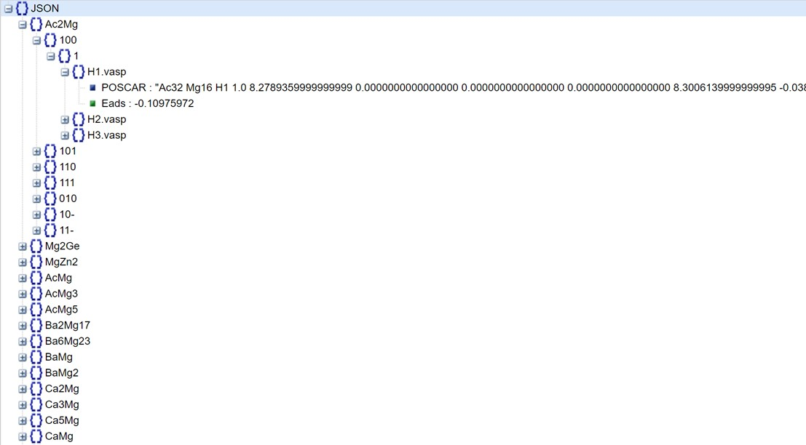

# Mg Corrosion DFT data

This is a Mg corrosion related dataabse, which include arouond 100k different H adosprtion structures on the Mg intermetallic phases and their corresponding predicted H adsorption energy.

# Table of Contents

- [Database](#Database)
- [Download](#Download)
- [Use the code](#Use-the-code)
- [References](#reference)
- [Acknowledgement](#Acknowledgement)

# Database
Their is the sub databbase in the data directory. The full dataset (around 1.33 GB) is avalable at [Here](https://drive.google.com/file/d/12ixEDfre9fCH5Bzj6DQJ7tNa1DR2zNsL/view?usp=sharing). The structure of the database is



# Download
```bash
git clone https://github.com/ywwang0/Mg-Corrosion-DFT-data.git
```

# Using
## Load the data set
```python
import json
with open('data/result_filter.json', 'r') as f:
    for line in f:
        filtered_data = json.loads(line)
```


# References
Accelerated discovery of magnesium intermetallic compounds with sluggish corrosion cathodic reactions through active learning and DFT calculations
Yaowei Wanga, Qingli Tanga, Xinchen Xub, Paul Wenga, Tao Yingb, Yao Yangb , Xiaoqin Zengb, Hong Zhua,b

# Acknowledgement
The research was financially supported by the National Key R&D Program (No. No. 2021YFB3501002) supported by the Ministry of Science and Technology of China, National Natural Science Foundation of China (No. 51825101, 52127801). First-principles calculations were carried out on the π 2.0 cluster supported by the Center for High Performance Computing at Shanghai Jiao Tong University.
