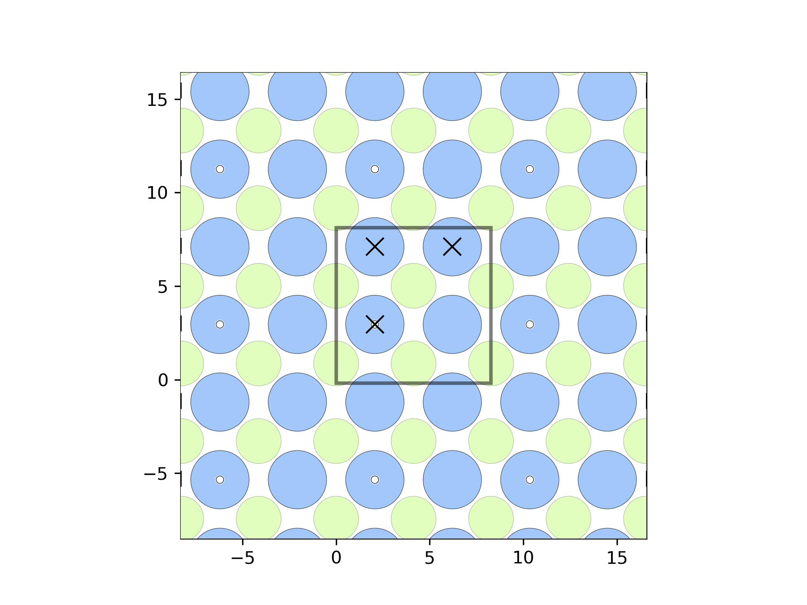

# Mg Corrosion DFT data

This is a Mg corrosion related dataabse, which include arouond 100k different H adosprtion structures on the Mg intermetallic phases and their corresponding predicted H adsorption energy.

# Table of Contents

- [Database](#Database)
- [Download](#Download)
- [Use the code](#Use-the-code)
- [References](#reference)
- [Acknowledgement](#Acknowledgement)

# Database
Their is the sub databbase in the data directory. The full dataset (around 1.33 GB) is avalable at [Here](https://drive.google.com/file/d/12ixEDfre9fCH5Bzj6DQJ7tNa1DR2zNsL/view?usp=sharing). The structure of the database is

# Download

# Using

# References

# Acknowledgement
